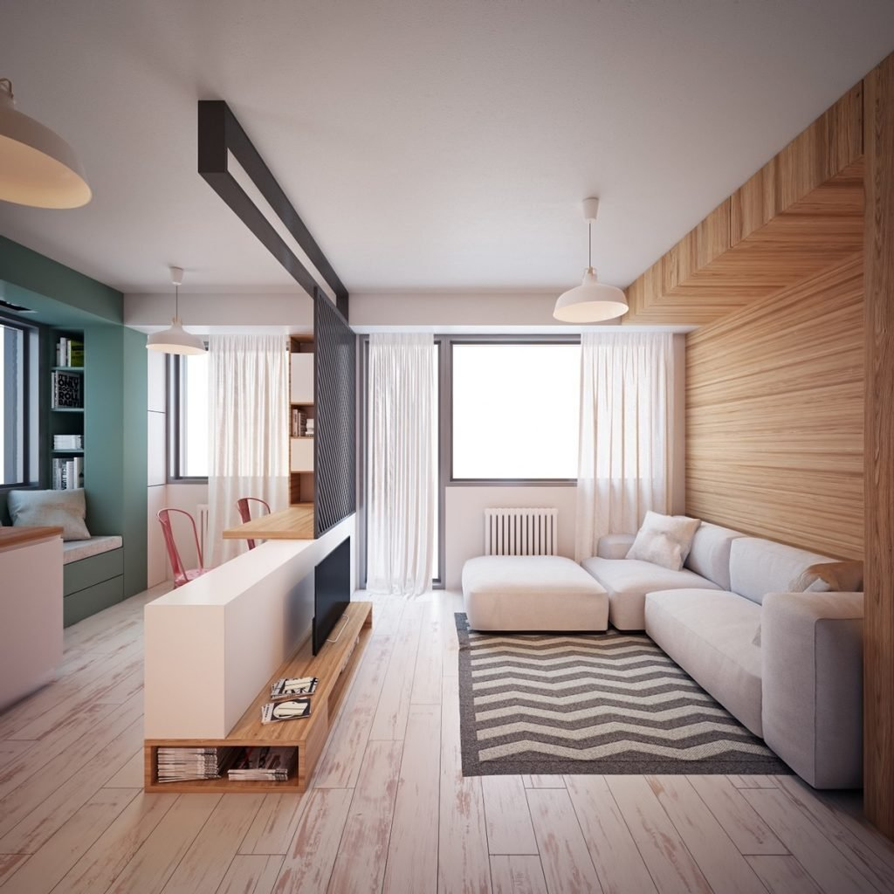
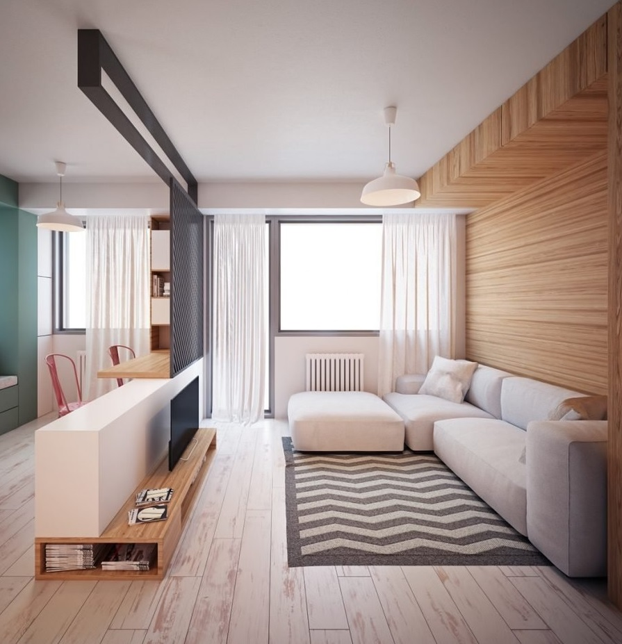

# Методы сравнения изображения в Python

## Какие могут быть случаи и проблемы?

Идеальный случай - полный дубликат.

Неидеальные случаи:
* Изображение изменено в размере
* Измененно соотношение сторон изображения
* В изображении есть изменения (водяной знак, подписи, замазки и т.д)
* Изменение цветовой гаммы изображения
* Отзеркаливание или поворот изображений
* Обрезка изображений

Установка дополнительных библиотек

```sh
pip3 install Pillow
pip3 install ImageHash
```

## Алгоритмы:
* Average hashing - ahash
* Perceptual hashing - phash
* Difference hashing - dhash

#### Тестирование

##### Изображение с исправлениями

||Изображение 1|Изображение 2|Разница хэша|
|-----|-----|-----|-----|
|Изображение||||
|ahash|bcfe3f1f3f674300|bcfe3f1f3f634300|1|
|dhash|70bce479ddc78fbc|70bce47dddc78fbc|1|
|phash|92de50cb1b6b4f81|82df50cb1b6b4f81|2|

##### Обрезка изображения

||Изображение 3|Изображение 4|Разница хэша|
|-----|-----|-----|-----|
|Изображение||||
|ahash|181c7c7e7e7e581c|3cbc5cde7ed2b018|16|
|dhash|e0b0d8d8d0d6b0b0|7070b8b8a0a62060|19|
|phash|d1927eed8361234e|d49b4f6791f9a003|22|

##### Отзеркаливание изображения

||Изображение 5|Изображение 6|Разница хэша|
|-----|-----|-----|-----|
|Изображение||||
|ahash|7f7f1b1b0e0c2cfc|fefed8d87030343f|28|
|dhash|dad8b636b4d9d9b0|a4e49293d26464f2|34|
|phash|98ace3532c6d6c39|cdf9960679383964|34|

##### Изображение разного размера (без изменения соотношения сторон)

||Изображение 7|Изображение 8|Разница хэша|
|-----|-----|-----|-----|
|Изображение||||
|ahash|ffd776f1b0601400|ffd776f1b0601400|0|
|dhash|68aca4a725c8e4a4|68aca4a725c8e4a4|0|
|phash|c6ec91f3eac58146|c6ec91f3eac58146|0|

##### Цветовой фильтр

||Изображение 9|Изображение 10|Разница хэша|
|-----|-----|-----|-----|
|Изображение||||
|ahash|7e7e7c7cfc343818|3c7e7c7c7c3c3818|4|
|dhash|e0c0e4e440656361|e0e0e4e4e064e060|8|
|phash|86f008e5d64ab6ed|87d028e7d80ab6ed|8|

##### Изменение соотношения сторон

||Изображение 11|Изображение 12|Разница хэша|
|-----|-----|-----|-----|
|Изображение||||
|ahash|7eee6e0d283e1e0f|7eee6e0d283e1e0f|0|
|dhash|f498c8dbda7c3898|f498c8dbda7c3c98|1|
|phash|91e39ccc2b14b7c3|91e39ccc2b14b7c3|0|

##### Разные изображения

||Изображение 1|Изображение 3|Разница хэша|
|-----|-----|-----|-----|
|Изображение||||
|ahash|bcfe3f1f3f674300|181c7c7e7e7e581c|25|
|dhash|70bce479ddc78fbc|e0b0d8d8d0d6b0b0|24|
|phash|92de50cb1b6b4f81|d1927eed8361234e|28|

### Скорость выполнения

Скорость выполнения 1000 итераций

|Метод|С учетом загрузки изображения|Без учета загрузки изображения|
|-----|-----|-----|
|aHash|11.260046482086182|4.433306455612183|
|dHash|11.380343914031982|4.411283493041992|
|pHash|12.440160989761353|5.216131925582886|

## Ссылки:
* ImageHash - https://pypi.org/project/ImageHash/